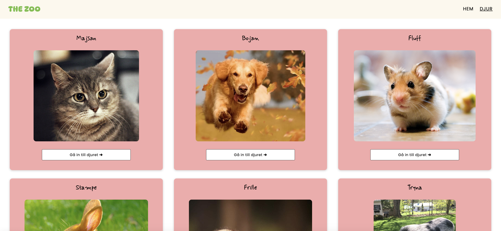
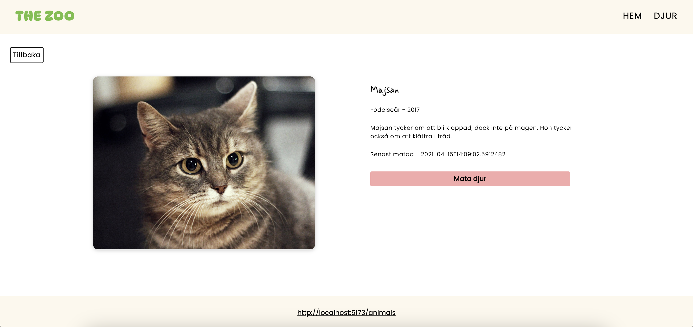
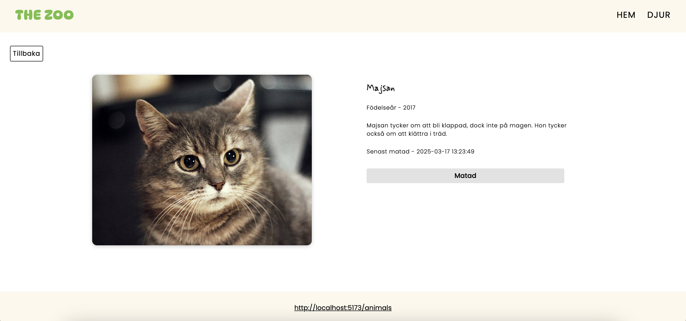
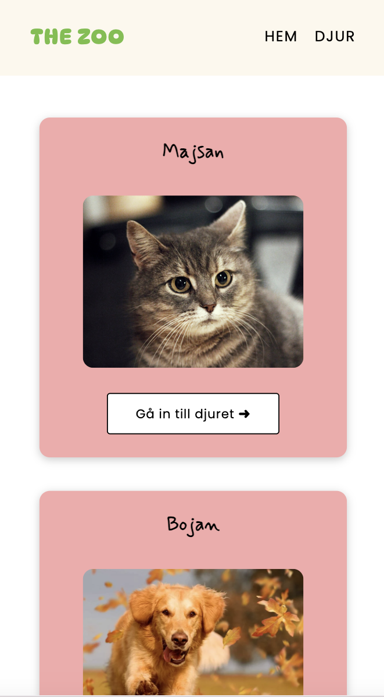
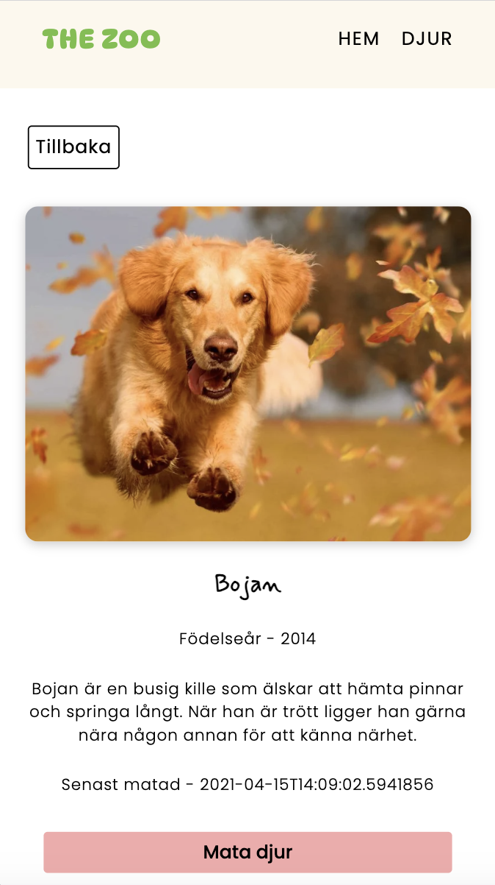

# The Zoo 
This is a [React](https://react.dev/) application built with [Vite](https://vite.dev/), using TypeScript to display animals from a zoo. The animals are fetched from an API, and the data is stored in localStorage. Users can view a list of animals with their names and short descriptions, and they can interact with the animal details to mark if the animal has been fed.

## Features
* **Animal Page** - Displays a list of animals with their names and a profile image. 
* **Animal Detail Page** - Clicking on an animal will take you to the detail page with more information about the specific animal. 
* **Feed Button** - The users can feed the animal on the detail page by clicking a "feed animal"/"mata djur" button. The button will be disabled when the animal has been fed and the feeding status will be updated along with the time the animal was fed. 
* **localStorage** - The animals data are stored in localStorage, so that the states are maintained even if the page is refreshed.

## Router 
```
export const router = createBrowserRouter ([
    {
        path: "/",
        element: <Layout/>,
        errorElement: <NotFound/>,
        children: [
            {
                path: "/",
                element: <Home/>,
            },
            {
                path: "/animals",
                element: <Animals/>,
            },
            {
                path: "/animal/:id",
                element: <Animal/>,
            },
        ]
    }
])
```

## Demo 





### Mobile view
<p>
  
  
  
</p>

## Installation
  ### 1. Clone this repository 
  ```
  git clone https://github.com/malinjansson/TheZoo.git
  ```

  ### 2. Navigate to the project folder
  ```
  cd TheZoo
  ```

  ### 3. Install dependencies 
  ```
  npm install
  ```

  ### 4. Run the application
  ```
  npm run dev 
  ```
  The application will be available at local: http://localhost:5173/
